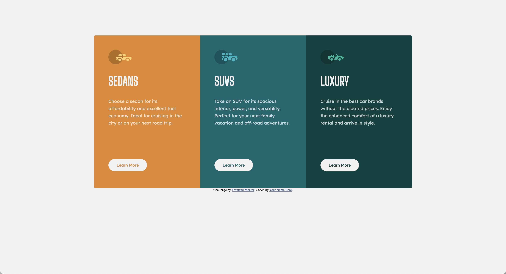
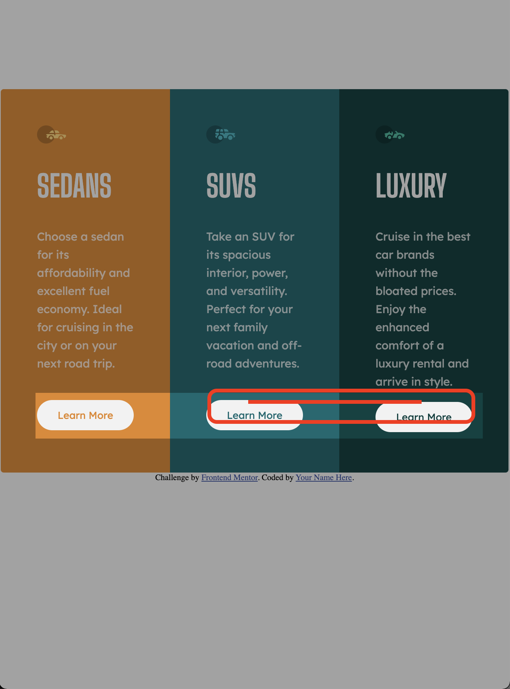

# Frontend Mentor - 3-column preview card component solution

This is a solution to the [3-column preview card component challenge on Frontend Mentor](https://www.frontendmentor.io/challenges/3column-preview-card-component-pH92eAR2-). Frontend Mentor challenges help you improve your coding skills by building realistic projects. 

## Table of contents

- [Overview](#overview)
  - [The challenge](#the-challenge)
  - [Screenshot](#screenshot)
  - [Links](#links)
- [My process](#my-process)
  - [Built with](#built-with)
  - [Continued development](#continued-development)
- [Author](#author)

## Overview

### The challenge

Users should be able to:

- View the optimal layout depending on their device's screen size
- See hover states for interactive elements

### Screenshot

### Links

- Solution URL: [Github pages](https://jackzorola10.github.io/3-column-preview-card-component-main/)
- Live Site URL: [Github Repo](https://github.com/jackzorola10/3-column-preview-card-component-main)

## My process

### Built with

- Semantic HTML5 markup
- CSS custom properties
- Flexbox
- Mobile-first workflow
- Media Queries

### Continued development

(1) I found myself in the problem that the screen sizes indicated that I should create the screens for Mobile: 375px & Desktop: 1440px, but those differentiations in the media queries simpky did not made the job for me, it made some of the cards look too crammed, so I ended up cutting the screens at 672px, which it seems like it worked much better. 

(2) I was not able to make the buttons align in every screen size, I'm not particularly sure what to do about this. 

## Author

- Website - [Jack Zorola](https://github.com/jackzorola10)
- Frontend Mentor - [@jackzorola10](https://www.frontendmentor.io/profile/jackzorola10)
- Twitter - [@jackzorola](https://www.twitter.com/jackzorola)

